# Cursor Rules Pack

This folder contains pre-configured Cursor rules (`.mdc` files) for the workshop.

**Location:** `.cursor/rules/`

## Installation

### Option 1: Copy to Your Project

1. Copy the `.cursor` folder to your project root
2. The rules will automatically be loaded by Cursor

```bash
# From project root
cp -r .cursor .
```

### Option 2: Extract from Zip

If you received this as a zip file:
1. Extract the `.cursor` folder
2. Place it in your project root directory

## Files Included

### Tech Stack Rules
- `tech-stack.mdc` - AI-native tech stack (Next.js, Supabase, Shadcn/ui, TanStack Query, Zod)
- `code-style.mdc` - Code style conventions for Next.js App Router
- `shadcn-ui.mdc` - Shadcn/ui component usage patterns
- `github-workflow.mdc` - Commit message conventions, Git workflow

### Development Workflow Rules
These rules define a structured workflow with clear start/stop points:

- `prd-creation.mdc` - **Step 1:** Create PRD from prompts or reference documents
- `implementation-plan.mdc` - **Step 2:** Create implementation plan from PRD
- `implementation-steps.mdc` - **Step 3:** Split plan into detailed step files
- `implement-step.mdc` - **Step 4:** Implement individual steps

## Development Workflow

### The Four-Step Process

```
1. PRD Creation        → docs/[feature]/prd.md
2. Implementation Plan → docs/[feature]/implementation-plan.md
3. Split into Steps    → docs/[feature]/00-index.md + phase files
4. Implement Steps     → Execute each phase, commit after each
```



```mermaid
flowchart LR
    subgraph Input["Input Options"]
        A1[User Prompt]
        A2[Reference MD File]
        A3[Folder of Docs]
    end
    
    subgraph Step1["Step 1: PRD"]
        B[prd-creation.mdc]
        B1[docs/feature/prd.md]
    end
    
    subgraph Step2["Step 2: Plan"]
        C[implementation-plan.mdc]
        C1[implementation-plan.md]
    end
    
    subgraph Step3["Step 3: Split"]
        D[implementation-steps.mdc]
        D1[00-index.md]
        D2[01-db-updates.md]
        D3[02-api-updates.md]
        D4[03-ui-components.md]
    end
    
    subgraph Step4["Step 4: Implement"]
        E[implement-step.mdc]
        E1[Execute Phase]
        E2[Verify Build]
        E3[Commit]
    end
    
    A1 --> B
    A2 --> B
    A3 --> B
    B --> B1
    B1 --> C
    C --> C1
    C1 --> D
    D --> D1
    D --> D2
    D --> D3
    D --> D4
    D1 --> E
    E --> E1
    E1 --> E2
    E2 --> E3
    E3 -->|Next Phase| E
    
    style Input fill:#3b82f6,color:#fff,stroke:#1d4ed8,stroke-width:2px
    style Step1 fill:#f59e0b,color:#fff,stroke:#d97706,stroke-width:2px
    style Step2 fill:#10b981,color:#fff,stroke:#059669,stroke-width:2px
    style Step3 fill:#8b5cf6,color:#fff,stroke:#7c3aed,stroke-width:2px
    style Step4 fill:#ef4444,color:#fff,stroke:#dc2626,stroke-width:2px
    style A1 fill:#60a5fa,color:#fff,rx:10,ry:10
    style A2 fill:#60a5fa,color:#fff,rx:10,ry:10
    style A3 fill:#60a5fa,color:#fff,rx:10,ry:10
    style B fill:#fbbf24,color:#000,rx:10,ry:10
    style B1 fill:#fcd34d,color:#000,rx:10,ry:10
    style C fill:#34d399,color:#000,rx:10,ry:10
    style C1 fill:#6ee7b7,color:#000,rx:10,ry:10
    style D fill:#a78bfa,color:#fff,rx:10,ry:10
    style D1 fill:#c4b5fd,color:#000,rx:10,ry:10
    style D2 fill:#c4b5fd,color:#000,rx:10,ry:10
    style D3 fill:#c4b5fd,color:#000,rx:10,ry:10
    style D4 fill:#c4b5fd,color:#000,rx:10,ry:10
    style E fill:#f87171,color:#fff,rx:10,ry:10
    style E1 fill:#fca5a5,color:#000,rx:10,ry:10
    style E2 fill:#fca5a5,color:#000,rx:10,ry:10
    style E3 fill:#fca5a5,color:#000,rx:10,ry:10
```

### Starting a Feature

**Option A: From a prompt**
```
"Create a PRD for [feature description]"
```

**Option B: From reference documents**
```
"Create a PRD based on @docs/reference/requirements.md"
```

### Workflow Commands

| Command | What It Does |
|---------|--------------|
| "Create PRD for [feature]" | Creates `docs/[feature]/prd.md` |
| "Create implementation plan" | Creates `docs/[feature]/implementation-plan.md` |
| "Split into steps" | Creates `00-index.md` and phase files |
| "Implement Phase 1" | Executes `01-db-updates.md` |
| "Implement Phase 2" | Executes `02-api-updates.md` |
| "Implement Phase 3" | Executes `03-ui-components.md` |

### Context Preservation

Each step is designed to be stoppable and resumable:
- All context is saved in markdown files
- The `00-index.md` tracks overall progress
- Each phase file is self-contained
- Resume by reading the index file to see current status

### Feature Documentation Structure

```
docs/
└── [feature-name]/
    ├── prd.md                    # Requirements (Step 1)
    ├── implementation-plan.md    # Technical approach (Step 2)
    ├── 00-index.md               # Progress tracker (Step 3)
    ├── 01-db-updates.md          # Database phase
    ├── 02-api-updates.md         # API phase
    ├── 03-ui-components.md       # UI phase
    ├── 04-integration.md         # Integration phase
    └── 05-testing.md             # Testing phase
```

## Verification

After installing, verify the rules are working:
1. Open Cursor
2. Open a TypeScript file (`.ts` or `.tsx`)
3. Ask Cursor AI to create a Supabase query or Next.js component
4. It should follow the patterns defined in the rule files:
   - Use TypeScript types from `@/types/database.types`
   - Use TanStack Query hooks
   - Use Shadcn/ui components
   - Follow commit message format: `type(scope): description`

## Customization

Feel free to modify these rules to match your team's preferences. The rules are written in Markdown and use frontmatter for configuration.
