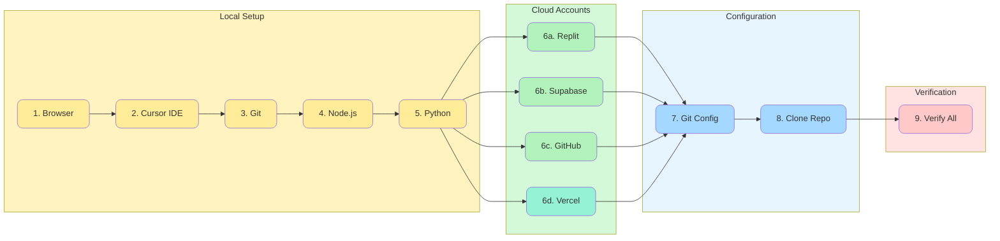

# Participant Setup Guide

**Purpose:** Step-by-step instructions for participants to set up their workstations  

---

## Setup Overview



---

## Prerequisites

Before the workshop, please complete the following setup. This should take 20-30 minutes.

**Note:** You have admin rights on your workstation and are responsible for installing the required software below.

---

## 1. Browser Requirements

You'll need a modern browser for Replit and Supabase:
- **Chrome** (recommended)
- **Firefox**
- **Edge**

Ensure your browser is up to date.

---

## 2. Install Cursor IDE

Cursor is an AI-powered code editor we'll use for local development.

1. Go to [https://cursor.sh](https://cursor.sh)
2. Download the installer for your operating system
3. Run the installer and follow the prompts
4. Launch Cursor and complete the initial setup

**Verification:** Open Cursor and confirm it launches without errors.

---

## 3. Install Git

Git is required for version control and syncing with GitHub.

### Windows
1. Download from [https://git-scm.com/download/win](https://git-scm.com/download/win)
2. Run the installer (accept defaults)
3. Open a terminal and run: `git --version`

### Mac
1. Open Terminal
2. Run: `git --version`
3. If prompted, install Xcode Command Line Tools

**Verification:** Run `git --version` in a terminal. You should see a version number.

---

## 4. Install Node.js

Node.js is required for running the Next.js application locally.

1. Go to [https://nodejs.org](https://nodejs.org)
2. Download the **LTS** version
3. Run the installer
4. Open a terminal and run: `node --version`

**Verification:** Run `node --version` and `npm --version` in a terminal.

---

## 5. Install Python

Python is required for Cursor scripting and Supabase CLI operations.

1. Go to [https://python.org/downloads](https://python.org/downloads)
2. Download the **latest stable version** (3.11 or higher recommended)
3. Run the installer
   - **Windows:** Check "Add Python to PATH" during installation
   - **Mac:** Python 3 may already be installed; verify first
4. Open a terminal and run: `python --version` (or `python3 --version` on Mac)

**Verification:** Run `python --version` and `pip --version` in a terminal.

---

## 6. Create / Access Your Accounts

### Replit
1. Go to [https://replit.com](https://replit.com)
2. Sign up or log in
3. Accept the team invitation (check your email)
4. Confirm you can see the team workspace

### Supabase
1. Go to [https://supabase.com](https://supabase.com)
2. Sign up or log in (use the same email as your invitation)
3. Accept the project invitation
4. Confirm you can see the project dashboard

### GitHub
1. Go to [https://github.com](https://github.com)
2. Sign up or log in
3. Accept the repository invitation
4. Confirm you can see the workshop repository

### Vercel
1. Go to [https://vercel.com](https://vercel.com)
2. Sign up using **"Continue with GitHub"** (recommended)
3. Accept the team invitation (if using a shared team)
4. Confirm you can see the team dashboard

**Note:** Vercel is used for deploying our applications. The free Hobby tier is sufficient.

---

## 7. Configure Git (First-Time Setup)

If this is your first time using Git, configure your identity:

```bash
git config --global user.name "Your Name"
git config --global user.email "your.email@example.com"
```

---

## 8. Clone the Workshop Repository

1. Open Cursor
2. Open the terminal (View → Terminal or Ctrl+`)
3. Navigate to where you want the project:
   ```bash
   cd ~/Documents
   ```
4. Clone the repository:
   ```bash
   git clone https://github.com/[ORG]/[REPO].git
   ```
5. Open the folder in Cursor: File → Open Folder

**Verification:** You should see the project files in Cursor's file explorer.

---

## 9. Verify Everything Works

Complete this checklist before the workshop:

| Check | Status |
|-------|--------|
| Cursor opens and runs | ⬜ |
| Git is installed (`git --version`) | ⬜ |
| Node.js is installed (`node --version`) | ⬜ |
| Python is installed (`python --version`) | ⬜ |
| Can log into Replit and see team | ⬜ |
| Can log into Supabase and see project | ⬜ |
| Can log into GitHub and see repo | ⬜ |
| Can log into Vercel and see team/dashboard | ⬜ |
| Repository cloned locally | ⬜ |

---

## Troubleshooting

### "Permission denied" when cloning
- Make sure you accepted the GitHub invitation
- Try using HTTPS instead of SSH
- Contact IT or facilitator

### Can't access Replit/Supabase/GitHub
- Check if you're on VPN; try disconnecting
- Check firewall settings with IT
- Try a different network (mobile hotspot)

### Cursor won't connect to AI
- Check your internet connection
- Restart Cursor
- Try a different built-in model (Claude, GPT, Composer)

---

## Need Help?

If you run into issues, contact:
- **Support Channel:** Internal Bennett & Pless IT Teams channel
- **IT Contact:** Kelvin Thom — kthom@bennett-pless.com
- **Facilitator:** David Miller — david@millerit.dev

Please complete this setup by **Tuesday evening** so we can troubleshoot any issues before the workshop.
