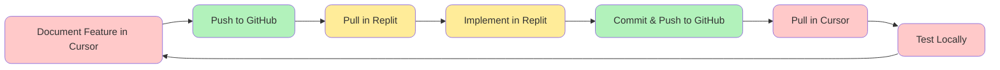
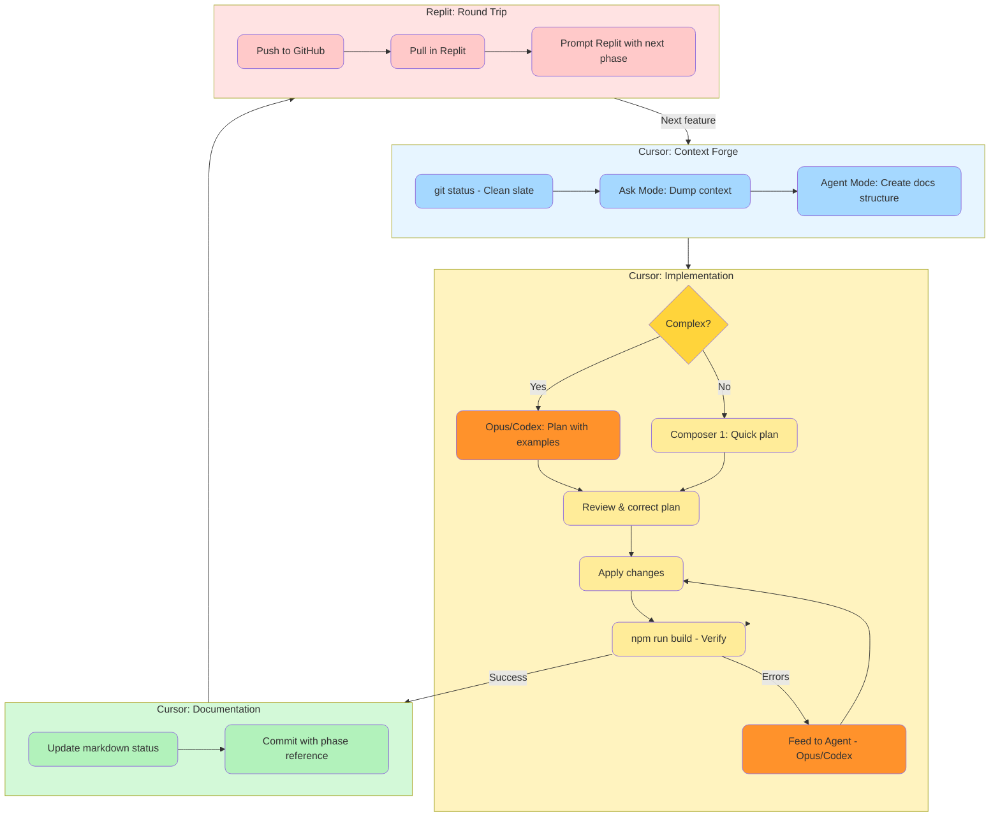

# Dev Flow

**Purpose:** Document the end-to-end development workflow for building AI-assisted tools using vibe coding methodology  
**Audience:** Workshop participants and facilitators  

---

## Overview

This document describes the iterative development flow used to build internal tools during the workshop. The process leverages AI assistants at every stage—from refining requirements to generating code to documentation.

### The "Vibe-to-Code" Stack

This stack is optimized for **AI-native development**. It prioritizes:
- **Type Safety** — so Cursor and Replit Agent don't hallucinate
- **Utility-first CSS** — for rapid UI generation  
- **Modular Architecture** — to survive the round-trips between tools

| Layer | Technology | Purpose |
|-------|------------|---------|
| **Framework** | Next.js 14+ (App Router) | Native to Vercel & Replit |
| **Language** | TypeScript | Non-negotiable — the "glue" that catches errors |
| **Styling** | Tailwind CSS | Atomic classes AI agents understand |
| **Components** | Shadcn/ui | Copy-pasted into repo — AI can read & modify |
| **Icons** | Lucide React | Industry standard for Next.js |
| **Database** | Supabase (PostgreSQL) | BaaS with auth, realtime, storage |
| **Data Fetching** | TanStack Query | Caching, loading states, optimistic updates |
| **Forms** | React Hook Form + Zod | Schema-first validation |
| **Version Control** | GitHub | Single source of truth |
| **Deployment** | Vercel | Auto-deploy on push |

### Tool Roles

| Tool | Role | Best For |
|------|------|----------|
| **Replit Agent** | Creative / Vibe | "Show me a dashboard that looks like X" |
| **Cursor** | Engineering / Logic | "Refactor this Supabase join and add error handling" |

```mermaid
flowchart TB
    subgraph Phase1["Phase 1: Requirements"]
        BRD[Rough Business Requirements]
        PRD[Detailed PRD]
        BRD -->|"AI Chat Refinement"| PRD
    end
    
    subgraph Phase2["Phase 2: Initial Build"]
        Prompt[UI Generation Prompt]
        Replit[Replit - Mock UI]
        PRD --> Prompt
        Prompt -->|"Generate"| Replit
    end
    
    subgraph Phase3["Phase 3: Source Control"]
        GH1[GitHub Repo]
        Local1[Clone to Local]
        Replit -->|"Commit"| GH1
        GH1 --> Local1
    end
    
    subgraph Phase4["Phase 4: Local Dev"]
        Doc1[Document: replit-ui.md]
        Node[Run Locally with Node]
        Supa[Supabase Integration]
        Local1 -->|"Cursor"| Doc1
        Doc1 --> Node
        Node --> Supa
    end
    
    subgraph Phase5["Phase 5: Feature Cycle"]
        FeatureDoc[Feature Docs]
        GH2[Push to GitHub]
        Replit2[Pull to Replit]
        Implement[Implement Features]
        GH3[Push Changes]
        Local2[Pull to Local]
        Supa --> FeatureDoc
        FeatureDoc --> GH2
        GH2 --> Replit2
        Replit2 --> Implement
        Implement --> GH3
        GH3 --> Local2
    end
    
    subgraph Phase6["Phase 6: Deploy"]
        Vercel[Vercel Integration]
        Prod[Hobby Prod Environment]
        Local2 --> Vercel
        Vercel -->|"Auto Deploy"| Prod
    end
    
    style Phase1 fill:#e7f5ff,color:#333
    style Phase2 fill:#fff3bf,color:#333
    style Phase3 fill:#d3f9d8,color:#333
    style Phase4 fill:#ffe3e3,color:#333
    style Phase5 fill:#f3d9fa,color:#333
    style Phase6 fill:#c3fae8,color:#333
    style BRD fill:#a5d8ff,color:#333,rx:10,ry:10
    style PRD fill:#a5d8ff,color:#333,rx:10,ry:10
    style Prompt fill:#ffec99,color:#333,rx:10,ry:10
    style Replit fill:#ffec99,color:#333,rx:10,ry:10
    style GH1 fill:#b2f2bb,color:#333,rx:10,ry:10
    style Local1 fill:#b2f2bb,color:#333,rx:10,ry:10
    style Doc1 fill:#ffc9c9,color:#333,rx:10,ry:10
    style Node fill:#ffc9c9,color:#333,rx:10,ry:10
    style Supa fill:#ffc9c9,color:#333,rx:10,ry:10
    style FeatureDoc fill:#e5dbff,color:#333,rx:10,ry:10
    style GH2 fill:#e5dbff,color:#333,rx:10,ry:10
    style Replit2 fill:#e5dbff,color:#333,rx:10,ry:10
    style Implement fill:#e5dbff,color:#333,rx:10,ry:10
    style GH3 fill:#e5dbff,color:#333,rx:10,ry:10
    style Local2 fill:#e5dbff,color:#333,rx:10,ry:10
    style Vercel fill:#96f2d7,color:#333,rx:10,ry:10
    style Prod fill:#96f2d7,color:#333,rx:10,ry:10
```



---

## Phase 1: Requirements Refinement

### Input
- Rough Business Requirements Document (BRD)
- Example: `docs/structure/BPI AI Tool Dev Session 1_PRD_ Contract Review_v1.md`

### Process
1. Load the BRD into an AI chat (Claude, ChatGPT, or Cursor Chat)
2. Ask clarifying questions to fill gaps
3. Identify missing acceptance criteria
4. Define edge cases and error handling
5. Iterate until requirements are complete

### Output
- Detailed PRD with:
  - Clear user stories
  - Acceptance criteria
  - Data model outline
  - UI/UX requirements
  - Error handling expectations

### Example Prompts
```
"Review this requirements document and identify any gaps or ambiguities 
that would block a developer from implementing it."

"What clarifying questions should I ask the stakeholder before building this?"

"Convert these business requirements into a detailed PRD with acceptance criteria."
```

---

## Phase 2: Initial UI Generation (Replit)

### Input
- Detailed PRD from Phase 1

### Process
1. Craft a prompt that describes the UI requirements
2. Include mock data structure in the prompt
3. Generate initial UI in Replit using AI assistant
4. Iterate on styling and layout
5. Test basic interactions with mock data

### Output
- Working UI prototype in Replit
- Uses hardcoded/mock data (no real backend yet)
- Basic navigation and layout complete

### Example Prompt Structure
```
Create a [type of app] with the following features:

**Data Model:**
[Describe entities and relationships]

**UI Requirements:**
- [Screen 1 description]
- [Screen 2 description]
- [Component descriptions]

**Mock Data:**
[Provide sample data JSON]

**Tech Stack:**
- Next.js 14+ with App Router and TypeScript
- Tailwind CSS + Shadcn/ui components
- Lucide React icons
- Mock data in separate file (easy to swap for Supabase later)

Generate a clean, modern UI with placeholder data.
```

---

## Phase 3: Source Control Setup

### Process
1. **In Replit:** Commit working UI to GitHub
   ```bash
   git init
   git add .
   git commit -m "Initial UI from Replit"
   git remote add origin https://github.com/[org]/[repo].git
   git push -u origin main
   ```

2. **Locally:** Clone the repository
   ```bash
   git clone https://github.com/[org]/[repo].git
   cd [repo]
   ```

### Output
- GitHub repository with initial commit
- Local clone ready for Cursor development

---

## Phase 4: Local Development Setup (Cursor)

### 4.1 Document Current Implementation

**Task:** Create `docs/replit-ui.md` documenting what Replit built

```markdown
# Replit UI Implementation

## Overview
[What was built, tech stack used]

## File Structure
[Tree of files and their purposes]

## Components
[List of components and their responsibilities]

## Mock Data Structure
[Current data shape]

## Known Limitations
[What's hardcoded, what's incomplete]
```

### 4.2 Get Running Locally with Node

**Task:** Use Cursor to ensure the Next.js app runs locally

```bash
npm install
npm run dev
```

Access the app at `http://localhost:3000`

**Common Issues to Resolve:**
- Missing dependencies
- Environment variable placeholders (ensure `.env.local` exists)
- Path differences between Replit and local

### 4.3 Convert Mock Data to Supabase

**Task:** Use Cursor + Supabase CLI to replace mock implementations

1. **Initialize Supabase locally:**
   ```bash
   supabase init
   supabase start
   ```

2. **Create schema from mock data structure:**
   - Generate `supabase/migrations/001_initial_schema.sql`
   - Apply: `supabase db reset`

3. **Generate TypeScript types (critical for AI accuracy):**
   ```bash
   npm run update-types
   ```
   This runs: `supabase gen types typescript --project-id <id> > src/types/database.types.ts`
   
   **Why this matters:** Once pushed to GitHub, Replit Agent "sees" your actual database columns, preventing 90% of round-trip bugs.

4. **Replace mock imports with Supabase client:**
   - Create `src/lib/supabase.ts` with typed client
   - Update components to use TanStack Query for data fetching
   - Add Zod schemas for form validation

5. **Seed database:**
   - Create `supabase/seed.sql`
   - Apply: `supabase db reset`

---

## Phase 5: Feature Development Cycle

### 5.1 Document Features to Add

**Task:** In Cursor, create feature documentation in `docs/[feature-name]/`

### 5.2 The Cycle



**Why this cycle?**
- **Replit:** Fast UI iteration with AI, instant preview
- **Cursor:** Better for backend, database, complex logic
- **GitHub:** Single source of truth, enables collaboration

---

## The Cursor Dev Loop: Surgical Coding

This elite-tier workflow transforms chaotic AI coding into a **disciplined, trackable, and reversible** engineering process. By separating the **Architect** (Opus/Codex in Ask/Agent mode) from the **Builder** (model selection based on complexity), you eliminate the "drift" that usually kills large features.



### Phase 1: The Context Forge (Architect Mode)

**Goal:** Set up the feature structure and gather all context.

1. **Safety Check:**
   ```bash
   git status
   ```
   Ensure a clean slate before starting.

2. **The Dialogue (Ask Mode):**
   - Use **Claude Opus 4.5** or **GPT 5.2 Codex** for complex reasoning
   - Dump your screenshots, PRD scraps, and `@Codebase` references
   - Ask clarifying questions, explore edge cases

3. **The Artifact (Agent Mode):**
   - Switch to Agent Mode to create the folder structure
   - **Prompt:** "Act as a Lead Architect. Create the `docs/[feature-name]/` directory and populate it. Ensure the `00-index.md` acts as a state machine for the entire feature."

### Phase 2: The Implementation Loop (Builder Mode)

**Goal:** Execute each phase file systematically.

#### Model Selection Strategy

| Feature Complexity | Model to Use | Notes |
|--------------------|--------------|-------|
| **Small/Simple** | Composer 1 | Quick UI tweaks, simple CRUD, minor refactors |
| **Medium/Complex** | Claude Opus 4.5 or GPT 5.2 Codex | Multi-file changes, business logic, database design |

> **Key Rule:** If delegating a complex plan to Composer 1 for implementation, have the higher model (Opus/Codex) include **example code snippets** in the plan. Composer 1 executes better with concrete examples.

1. **The Handshake (Plan Mode):**
   - For **small features**: Use Composer (Plan Mode) directly
   - For **complex features**: Use Claude Opus 4.5 or GPT 5.2 Codex in Ask Mode first
   - Drag **one phase file** (e.g., `01-db-updates.md`) into the context
   - Only one file at a time to prevent context overload

2. **The Consensus:**
   - **Never let the AI code until the plan matches your vision**
   - Review the generated plan list carefully
   - If it misses a Supabase RLS policy or a Zod validation step, **correct the plan first**
   - For complex plans: Ask the model to provide **example implementations** in the plan

3. **The Execution:**
   - **Simple tasks:** Switch to Composer Act/Apply mode
   - **Complex tasks:** Stay in Claude Opus 4.5 / GPT 5.2 Codex and use Agent Mode
   - Let Cursor implement the agreed plan

4. **The Verification:**
   ```bash
   npm run build
   ```
   - Check build output immediately
   - If it fails, feed the error back into **Agent window** (not Composer)—it has better debugging context

### Phase 3: Documentation as State

**Goal:** Maintain an audit trail of all changes.

1. **The Update:**
   - After each phase, have the Agent update the markdown:
   - **Prompt:** "Mark Phase 1 as complete in `00-index.md` and append any architectural changes we made during implementation to `01-db-updates.md` for future context."

2. **The Commit:**
   - Once the build is green, commit with a clear phase reference:
   ```bash
   git add .
   git commit -m "feat(feature-name): complete 01-db-updates"
   ```

### Phase 4: The Round Trip (Replit Integration)

**Goal:** Hand off UI work to Replit with full context.

1. **Push to GitHub:**
   ```bash
   git push origin main
   ```

2. **Pull in Replit:**
   - Open the `docs/` folder in Replit
   - Review the completed phases

3. **Prompt Replit Agent:**
   ```
   I have completed the DB and API layers in Cursor. Using the plan in 
   03-ui-updates.md, build the frontend components. Refer to replit-ui.md 
   to keep the styling consistent with our Shadcn/ui + Tailwind setup.
   ```

### Why This Works for Complex & Large Features

| Benefit | How It's Achieved |
|---------|-------------------|
| **Context Management** | Drag only one phase file at a time; use higher models for complex reasoning |
| **Model Selection** | Opus/Codex for planning & complex tasks; Composer 1 for simple execution |
| **Audit Trail** | Literal paper trail in `docs/` explaining every change |
| **Error Isolation** | Compiling between phases prevents "house of cards" bugs |
| **Reversibility** | Each phase is a commit; easy to revert if needed |

### The Golden Rule

> **If the AI starts hallucinating:** Use `/summarize` to compact the context within the same chat. This summarizes the AI's short-term memory while preserving the conversation thread. Then re-reference the latest `@0x-phase.md` file to refocus on the current phase.

### Cursor Mode & Model Quick Reference

| Mode | Model | When to Use | Best For |
|------|-------|-------------|----------|
| **Ask Mode** | Claude Opus 4.5 / GPT 5.2 Codex | Phase 1, complex planning | Architecture, exploration, detailed plans with examples |
| **Agent Mode** | Claude Opus 4.5 / GPT 5.2 Codex | Phase 1, 2 (complex), 3 | File creation, multi-file changes, debugging |
| **Composer (Plan)** | Composer 1 | Phase 2 (simple) | Quick review of small implementation plans |
| **Composer (Act)** | Composer 1 | Phase 2 (simple) | Implementing small, well-defined tasks |

> **Tip:** When handing off to Composer 1, include example code in the plan. Composer 1 executes better with concrete patterns to follow.

---

## Phase 6: Deployment (Vercel)

### Setup
1. Connect Vercel to GitHub repository
2. Configure project settings:
   - Framework preset: **Next.js** (auto-detected)
   - Build command: `next build` (default)
   - Output directory: `.next` (default)
3. Set environment variables in Vercel dashboard

### Auto-Deploy Configuration
- **Production:** Deploy on merge/commit to `main`
- **Preview:** Deploy on PR (optional)

### Environment Variables
| Location | File/Setting | Contents |
|----------|--------------|----------|
| Local | `.env` | `SUPABASE_URL`, `SUPABASE_ANON_KEY`, etc. |
| Vercel | Dashboard → Settings → Environment Variables | Same keys, production values |
| Replit | Secrets tab | Same keys, dev/staging values |

**Important:** Never commit `.env` files. Use `.env.example` as a template.

---

## Feature Documentation Structure

For each feature, create a folder under `docs/`:

```
docs/
└── [feature-name]/
    ├── prd.md                    # Feature requirements
    ├── implementation-plan.md    # High-level approach
    ├── 00-index.md               # Overview & checklist
    ├── 01-db-updates.md          # Database changes
    ├── 02-api-updates.md         # API/backend changes
    ├── 03-ui-updates.md          # Frontend changes
    └── ...                       # Additional steps as needed
```

### prd.md Template
```markdown
# Feature: [Name]

## Problem Statement
[What problem does this solve?]

## User Stories
- As a [user], I want [action] so that [benefit]

## Acceptance Criteria
- [ ] Criterion 1
- [ ] Criterion 2

## Out of Scope
- [What this feature does NOT include]
```

### 00-index.md Template (State Machine)

This file acts as the **state machine** for the entire feature—tracking what's done, what's in progress, and what's next.

```markdown
# Feature: [Name]

## Status: 🟡 In Progress

## Phases

| Phase | File | Status | Commit |
|-------|------|--------|--------|
| 1. Database | 01-db-updates.md | ✅ Complete | `abc123` |
| 2. API | 02-api-updates.md | 🟡 In Progress | — |
| 3. UI | 03-ui-updates.md | ⬜ Pending | — |
| 4. Testing | 04-testing.md | ⬜ Pending | — |

## Current Context
[What the AI needs to know to continue from here]

## Architectural Decisions
- [Decision 1]: [Rationale]
- [Decision 2]: [Rationale]

## Blockers / Open Questions
- [ ] [Question or blocker]
```

### implementation-plan.md Template
```markdown
# Implementation Plan: [Feature Name]

## Overview
[Brief description of approach]

## Dependencies
- [Other features or systems this depends on]

## Steps
1. Database updates (see 01-db-updates.md)
2. API updates (see 02-api-updates.md)
3. UI updates (see 03-ui-updates.md)

## Risks & Mitigations
- Risk: [description]
  - Mitigation: [approach]
```

### Step File Template (e.g., 01-db-updates.md)
```markdown
# Phase 1: Database Updates

## Status: ⬜ Pending | 🟡 In Progress | ✅ Complete

## Planned Changes
- [ ] Add table: `table_name`
- [ ] Add column: `existing_table.new_column`
- [ ] Create RLS policies
- [ ] Create index: `idx_name`
- [ ] Add Zod schema in `schemas/`
- [ ] Run `npm run update-types`

## Migration SQL
```sql
-- Migration content here
```

## Rollback SQL
```sql
-- Rollback content here
```

## Verification
- [ ] `npm run build` passes
- [ ] Migration runs without errors
- [ ] Seed data loads correctly
- [ ] Types regenerated successfully

## Implementation Notes
[Added during/after implementation — architectural changes, gotchas, decisions made]
```

---

## Quick Reference: Git Commands

### Replit → GitHub → Local
```bash
# In Replit
git add .
git commit -m "feat(feature-name): description"
git push

# Locally (Cursor terminal)
git pull origin main
```

### Local → GitHub → Replit
```bash
# Locally (Cursor terminal)
git add .
git commit -m "feat(feature-name): description"
git push

# In Replit
git pull origin main
```

### Commit Message Format

Use conventional commits with parentheses: `type(scope): description`

**Types & Examples:**
```bash
# New feature
git commit -m "feat(contracts): add file upload component"

# Bug fix
git commit -m "fix(auth): resolve session refresh on token expiry"

# Documentation
git commit -m "docs(readme): update local setup instructions"

# Refactoring (no behavior change)
git commit -m "refactor(api): simplify Supabase query helpers"

# Styling/formatting only
git commit -m "style(ui): fix inconsistent button padding"

# Tests
git commit -m "test(contracts): add unit tests for validation"

# Build/dependencies/tooling
git commit -m "chore(deps): update TanStack Query to v5"

# Phase-specific commits (recommended for this workflow)
git commit -m "feat(contract-review): complete 01-db-updates"
git commit -m "feat(contract-review): complete 02-api-updates"
git commit -m "feat(contract-review): complete 03-ui-updates"
```

**Guidelines:**
- Keep subject under 50 characters
- Use imperative mood ("Add feature" not "Added feature")
- Scope should match the feature folder name when applicable

---

## Environment Setup Checklist

### Local (.env)
```bash
SUPABASE_URL=http://localhost:54321
SUPABASE_ANON_KEY=your-local-anon-key
SUPABASE_SERVICE_KEY=your-local-service-key
```

### Replit (Secrets)
```
SUPABASE_URL=https://[project].supabase.co
SUPABASE_ANON_KEY=your-dev-anon-key
```

### Vercel (Environment Variables)
```
SUPABASE_URL=https://[project].supabase.co
SUPABASE_ANON_KEY=your-prod-anon-key
```

---

## Troubleshooting

### Replit not seeing GitHub changes
```bash
git fetch origin
git reset --hard origin/main
```

### Local not seeing Replit changes
```bash
git pull --rebase origin main
```

### Supabase connection issues locally
1. Verify Supabase is running: `supabase status`
2. Check `.env` has correct local URLs
3. Restart: `supabase stop && supabase start`
